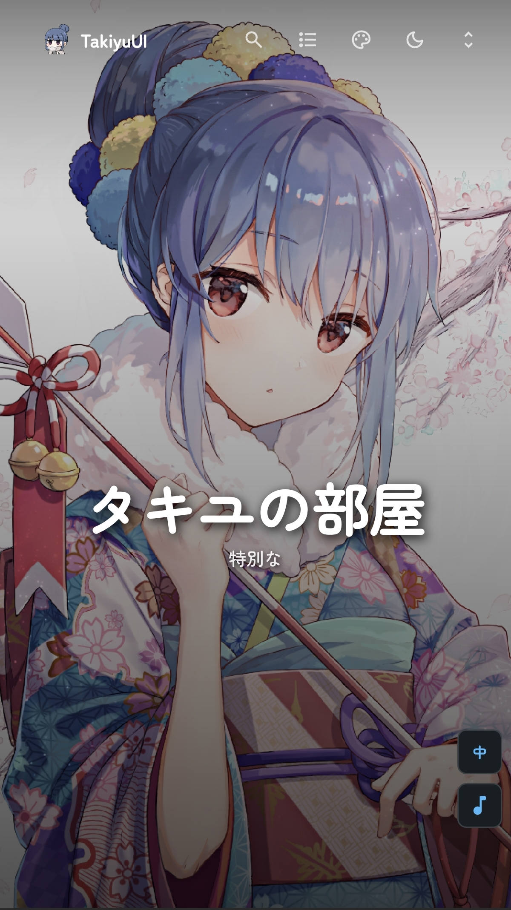
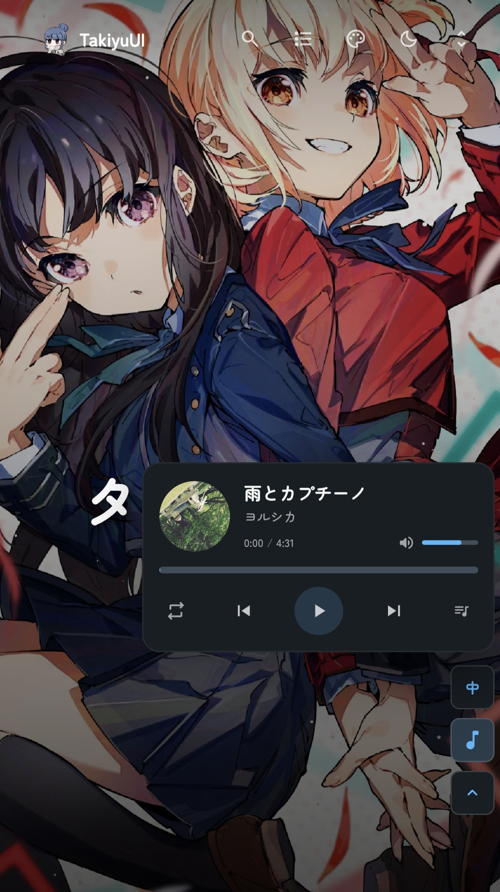

# Takiyu Blog

基于 [Mizuki](https://github.com/LyraVoid/Mizuki) 深度自定义的个人博客，使用 Astro 构建并部署于 Vercel。

> 在线访问：<https://takiyu-wiki.ccwu.cc/>

## 界面预览

### 桌面端


### 移动端

<p align="center">
  
  &nbsp;&nbsp;
  
</p>

## 项目简介

这是 Takiyu 的个人博客源码仓库。项目保留了 Mizuki 的响应式设计、文章系统和丰富主题功能，并加入了个人化横幅、导航、资料、设备页面与本地音乐等内容。

## 主要功能

- 响应式桌面端与移动端布局
- 日间 / 夜间主题及主题色切换
- Banner、全屏、Overlay 等多种壁纸模式
- Markdown / MDX 文章、分类、标签、归档与全文搜索
- 本地音乐与 Meting 歌单播放器
- 番剧、日记、相册、设备、项目、技能、时间线等扩展页面
- Live2D、目录、阅读进度、代码高亮与数学公式支持
- RSS、Atom、Sitemap 与 SEO 配置
- Vercel 自动构建和部署

## 技术栈

- [Astro](https://astro.build/) 7
- [Svelte](https://svelte.dev/) 5
- TypeScript
- Tailwind CSS 4
- Pagefind
- pnpm

## 本地运行

请先安装 Node.js 和 pnpm，然后执行：

```bash
git clone https://github.com/Takiyu0928/Takiyu-blog.git
cd Takiyu-blog
pnpm install
pnpm dev
```

开发服务器启动后，浏览器访问终端显示的本地地址，通常为：

```text
http://localhost:4321/
```

构建和预览生产版本：

```bash
pnpm build
pnpm preview
```

## 常用配置入口

| 内容 | 文件 |
| --- | --- |
| 站点名称、域名、语言、主题、横幅 | `src/config/siteConfig.ts` |
| 顶部导航栏和二级菜单 | `src/config/navBarConfig.ts` |
| 个人资料和社交链接 | `src/config/profileConfig.ts` |
| 侧边栏组件 | `src/config/sidebarConfig.ts` |
| 背景壁纸 | `src/config/backgroundWallpaper.ts` |
| 音乐播放器 | `src/config/musicConfig.ts` |
| 公告 | `src/config/announcementConfig.ts` |
| 页脚 | `src/config/footerConfig.ts` |
| 设备页面 | `src/data/devices.ts` |

## 内容与静态资源

- 文章：`src/content/posts/`
- About 页面：`src/content/spec/about.md`
- 公共图片：`public/assets/`
- 本地歌曲：`src/assets/music/song/`
- 音乐列表：`src/components/widgets/music-player/constants.ts`

新增文章时，可以在 `src/content/posts/` 下创建目录和 `index.md`，也可以运行：

```bash
pnpm new-post
```

## 部署到 Vercel

1. 在 Vercel 中导入本仓库。
2. Framework Preset 选择 Astro（通常会自动识别）。
3. Install Command 保持 `pnpm install`。
4. Build Command 保持 `pnpm build`。
5. Output Directory 保持 Astro 默认设置。
6. 部署成功后，在项目的 Domains 页面绑定自定义域名。

如果启用了内容分离模式，请根据实际情况配置 `ENABLE_CONTENT_SYNC`、`CONTENT_REPO_URL` 等环境变量；当前使用本地内容时无需设置。

## 致谢

- [LyraVoid/Mizuki](https://github.com/LyraVoid/Mizuki)
- [saicaca/fuwari](https://github.com/saicaca/fuwari)
- Astro、Svelte、Tailwind CSS 及所有相关开源项目

## 许可证

本项目遵循仓库中的 [Apache License 2.0](./LICENSE)。原始 Fuwari 相关内容的 MIT 许可证见 [LICENSE.MIT](./LICENSE.MIT)，第三方声明见 [THIRD_PARTY_NOTICES.md](./THIRD_PARTY_NOTICES.md)。
